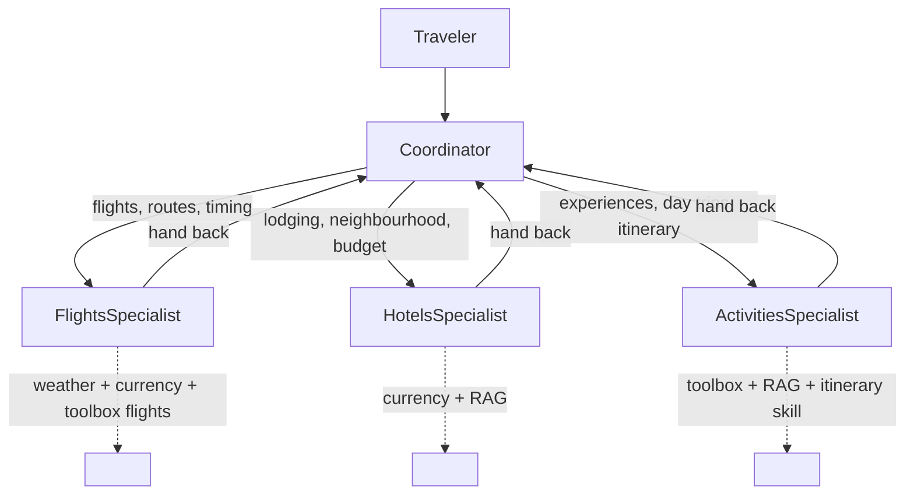

# Step 7 — Multi-agent: hand off to specialists at runtime

> **Goal:** split TravelBuddy into a **Coordinator** plus **Flights / Hotels / Activities** specialists that the Coordinator hands the active turn to as the conversation unfolds — while every specialist reuses a slice of the Step 6 tools, toolbox, RAG, and skill.

## What you'll learn

- The Agent Framework's native multi-agent primitives — `SequentialBuilder`, `ConcurrentBuilder`, and `HandoffBuilder`
- When **runtime handoff** beats a fixed workflow: dynamic, user-driven branching where the next expert isn't known in advance
- How to give each specialist a narrow capability slice from the carried stack (tools, toolbox, RAG, skill)
- How `workflow.as_agent()` exposes the whole graph as one hosted agent, so deployment is unchanged (`resources: []`, no `azd provision`)

## What's already in the repo

- Everything from Steps 1–6 in `travel_assistant/` — the three function tools, the Foundry Toolbox, the Step 5 RAG provider, and the Step 6 itinerary skill. Nothing was deleted when you advanced.
- `travel_toolbox/toolbox.yaml` — the toolbox definition, still a sibling of `travel_assistant/`.
- `travel_assistant/agents/{flights,hotels,activities}/` and `travel_assistant/coordinator.py` — scaffolding delivered when you advanced; you fill them in below.

In this step you make **delta-only** edits: add per-specialist config slices under `agents/`, build the handoff graph in `coordinator.py`, and point `main.py` at the Coordinator. There are **no** new environment variables and no manifest env changes — only a `Multi-Agent` tag and a `handoff` metadata block.

## Concept (5-min read)

A single-agent assistant is the simplest shape: one instruction set, one tool list, one history, one model deciding every step. That's great while TravelBuddy's job is narrow. As it grows, the prompt starts carrying too many responsibilities — flight trade-offs, hotel constraints, destination grounding, itinerary generation, web lookups, and user-facing coordination all at once.

A **multi-agent runtime** keeps one conversation but splits responsibilities into focused agents. The **Coordinator** speaks first, decides what the traveler is asking for, and hands the active turn to the specialist that owns the next part of the answer. A specialist uses only the capabilities it needs, then hands control back to the Coordinator when the topic changes or the answer needs synthesis.

**Handoff vs. workflow.** The Agent Framework gives you several shapes:

- `SequentialBuilder` passes work through agents in a fixed order.
- `ConcurrentBuilder` fans the same task out to several agents and aggregates the results.
- `HandoffBuilder` is the **runtime-collaboration** shape we use here — the active agent transfers control to another participant when the conversation calls for a different specialist.

Handoff wins when the *user* drives the path and the next expert isn't known until the conversation unfolds. A **workflow** (Step 8) wins when the process is known ahead of time: gather → specialists → approve → finalize. This step is runtime collaboration; Step 8 re-expresses the same trip-planning scenario as a durable, observable pipeline.

The important design choice isn't the number of agents — it's the **boundary** around each one. Each specialist gets a short purpose statement, a narrow capability slice, and a clear rule about when to hand back. Those slices come straight from the carried stack:



**One hosted agent, or many? (in-process vs. A2A).** Notice all four agents live in the *same* process and share one `FoundryChatClient`; `workflow.as_agent()` then wraps the whole graph as a **single** hosted agent — so deployment is unchanged (`resources: []`, no `azd provision`). Handoffs are in-memory function calls: fast, simple, and easy to trace. The alternative is to deploy each specialist as its **own** hosted agent and have the Coordinator reach them remotely over the **A2A (Agent-to-Agent) protocol** (or expose one deployed agent as a function tool of another). Remote agents can be scaled, versioned, owned, and reused independently — even across teams, languages, or vendors — but every handoff now pays a network hop plus auth and serialization cost, and you operate N deployments instead of one. Rule of thumb: keep chatty, tightly-coupled specialists **in-process** (what we do here); reach for **A2A** only when a specialist genuinely needs to be independently deployed or reused. The two compose — a hosted agent like this one can itself be a node in a larger A2A mesh.

**Learn more**

- [Handoff orchestration in Microsoft Agent Framework](https://learn.microsoft.com/agent-framework/user-guide/agent-orchestration/handoff)
- [Agent orchestration overview](https://learn.microsoft.com/agent-framework/user-guide/agent-orchestration/)
- [Using workflows as agents](https://learn.microsoft.com/agent-framework/user-guide/workflows/workflows-as-agents)
- [Agent-to-Agent (A2A) protocol in Microsoft Agent Framework](https://learn.microsoft.com/agent-framework/journey/agent-to-agent)
- [Connect to an A2A agent endpoint from Foundry Agent Service](https://learn.microsoft.com/azure/foundry/agents/how-to/tools/agent-to-agent)

## Steps

### 1. Create three specialist config slices

Create one folder per specialist under `travel_assistant/agents/`. Each folder gets an `agent.yaml` and `agent.manifest.yaml` slice. These document the role and capability boundary — even though `coordinator.py` constructs the agents directly — so a reviewer can see at a glance what each specialist may touch.

```text
travel_assistant/agents/
├── flights/     { agent.yaml, agent.manifest.yaml }   # weather + currency + toolbox flights
├── hotels/      { agent.yaml, agent.manifest.yaml }   # currency + destinations RAG
└── activities/  { agent.yaml, agent.manifest.yaml }   # toolbox + RAG + itinerary skill
```

The Flights slice, for example:

```yaml
# travel_assistant/agents/flights/agent.yaml
kind: Prompt
name: FlightsSpecialist
displayName: Flights Specialist
description: Handles flight timing, routing, airport, weather-risk, and currency questions.
instructions: |
  You are the Flights specialist for TravelBuddy.
  Scope: compare flight timing, routing, airports, layovers, and arrival windows;
  use flight search from the toolbox for specific routes (if no departure date is
  given, call get_local_time and use the date part of its iso_time); use weather for
  disruption risk and currency for fares.
  Boundaries: do not choose hotels or activities. Hand back to the Coordinator when
  the traveler asks about lodging, experiences, or the complete plan.
```

```yaml
# travel_assistant/agents/flights/agent.manifest.yaml
name: flights-specialist
version: 0.1.0
description: Tool slice for the Flights specialist.
tools:
  - name: get_weather
    source: travel_assistant.tools
  - name: get_local_time
    source: travel_assistant.tools
  - name: convert_currency
    source: travel_assistant.tools
  - name: travel-toolbox
    source: foundry-toolbox
rag: []
skills: []
```

The Hotels slice adds the destinations index (RAG) and drops the toolbox; the Activities slice adds the toolbox, RAG, **and** the itinerary skill. See [`.workshop/solutions/07-multi-agent/travel_assistant/agents/`](.workshop/solutions/07-multi-agent/travel_assistant/agents/) for all three. Three small slices make each specialist's intended boundary explicit and easy to review — they're the architecture spec a teammate reads before touching the graph.

> **These slices are documentation, not runtime config.** Nothing loads `agent.yaml`/`agent.manifest.yaml` at run time. In the next section `coordinator.py` builds each specialist directly in Python: the `instructions:` become string constants and the tool/RAG/skill slices become hand-written `tools=[...]` and `context_providers=[...]` arguments. The slices are the reviewable **contract**; `coordinator.py` is the executable **source of truth**. That means they can drift, so when a specialist behaves unexpectedly, inspect `coordinator.py` first — then realign the slice so the two agree.

### 2. Build the handoff graph in `coordinator.py`

The Coordinator is the only agent the traveler intentionally talks to. `coordinator.py` ships as a starter scaffold with `TODO`s — you fill in the instruction constants, the per-specialist capability slices, and the handoff edges below. `HandoffBuilder` registers the participants, generates the handoff tools, sets the start agent as the entry point, and defines which agents may hand off to which. It lives in `agent_framework.orchestrations` — a separate `agent-framework-orchestrations` package, already added to `requirements.txt` for this step. Each specialist is a normal `Agent` — the same constructor from Steps 4–6 — with a sliced `tools` list and, where relevant, sliced `context_providers` (RAG and the skill). This is where the `agents/*/agent.yaml` slices become executable: their `instructions:` turn into the string constants below, and their tool/RAG/skill lists into the hand-written `tools=[...]`/`context_providers=[...]` arguments.

**Why every participant sets `require_per_service_call_history_persistence=True`.** Normally the framework only persists a completed request/response pair to conversation history. But a handoff fires *mid-turn*: the active agent calls a generated handoff tool, and control transfers to the next participant before that tool call resolves. With the default setting that in-flight, unresolved call would be dropped, leaving a gap the next participant can't reason over. The flag tells each agent to persist history on **every service call** — including the partial one interrupted by the handoff — so the receiving specialist sees the full context. `HandoffBuilder.build()` validates this and raises a `ValueError` if any participant is missing the flag, so set it on the Coordinator and all three specialists.

```python
# travel_assistant/coordinator.py
from agent_framework import Agent, SkillsProvider
from agent_framework.azure import AzureAISearchContextProvider
from agent_framework.foundry import FoundryChatClient
from agent_framework.orchestrations import HandoffBuilder
from agent_framework_foundry_hosting import FoundryToolbox
from azure.identity import DefaultAzureCredential

from tools import convert_currency, get_local_time, get_weather
# ... run_local_skill_script carried from Step 6 lives here too ...


def build_travel_coordinator() -> Agent:
    credential = DefaultAzureCredential()
    client = FoundryChatClient(
        project_endpoint=os.environ["AZURE_AI_PROJECT_ENDPOINT"],
        model=os.environ["AZURE_AI_MODEL_DEPLOYMENT_NAME"],
        credential=credential,
    )

    # Carried capabilities, sliced per specialist below.
    toolbox = FoundryToolbox(credential)
    search = _build_search_provider(credential)   # AzureAISearchContextProvider
    skills = SkillsProvider.from_paths(
        skill_paths=Path(__file__).parent / "skills",
        script_runner=run_local_skill_script,
    )

    coordinator = Agent(
        client=client, name="Coordinator", instructions=COORDINATOR_INSTRUCTIONS,
        require_per_service_call_history_persistence=True,
    )

    flights = Agent(
        client=client, name="FlightsSpecialist", instructions=FLIGHTS_INSTRUCTIONS,
        tools=[get_weather, get_local_time, convert_currency, toolbox],
        require_per_service_call_history_persistence=True,
    )
    hotels = Agent(
        client=client, name="HotelsSpecialist", instructions=HOTELS_INSTRUCTIONS,
        tools=[convert_currency],
        context_providers=[search],
        require_per_service_call_history_persistence=True,
    )
    activities = Agent(
        client=client, name="ActivitiesSpecialist", instructions=ACTIVITIES_INSTRUCTIONS,
        tools=[toolbox],
        context_providers=[search, skills],
        require_per_service_call_history_persistence=True,
    )

    workflow = (
        HandoffBuilder(
            name="travelbuddy-runtime-handoff",
            participants=[coordinator, flights, hotels, activities],
        )
        .with_start_agent(coordinator)
        .add_handoff(coordinator, [flights, hotels, activities])
        .add_handoff(flights, [coordinator])
        .add_handoff(hotels, [coordinator])
        .add_handoff(activities, [coordinator])
        .build()
    )

    return workflow.as_agent()
```

The key lines are the graph edges:

- `with_start_agent(coordinator)` sends each new user request to the Coordinator first.
- `add_handoff(coordinator, [flights, hotels, activities])` lets the Coordinator pick a specialist.
- `add_handoff(flights, [coordinator])` (and the hotel/activity edges) let specialists return control for synthesis or another branch.
- `workflow.as_agent()` wraps the multi-agent runtime so the rest of the app treats it like a single hosted agent.

Because the toolbox is one bundle (web search + Code Interpreter + OctoTrip flights), both Flights and Activities receive the whole toolbox; the tighter boundary is enforced by each specialist's instructions.

### 3. Point `main.py` at the Coordinator

`main.py` collapses to constructing the Coordinator and hosting it through the same adapter as before:

```python
# travel_assistant/main.py
from agent_framework_foundry_hosting import ResponsesHostServer

from coordinator import build_travel_coordinator


def main() -> None:
    agent = build_travel_coordinator()   # the handoff graph, exposed as one agent
    ResponsesHostServer(agent).run()


if __name__ == "__main__":
    main()
```

### 4. Update the manifest

Metadata-only: append the `Multi-Agent` tag, update the `description`, and add a `handoff` block naming the coordinator + specialists. No new `template.environment_variables`; `resources` stays `[]`.

```yaml
# travel_assistant/agent.manifest.yaml (delta)
metadata:
  tags: [Agent Framework, AI Agent Hosting, Azure AI AgentServer, Responses Protocol, Travel Assistant, Function Tools, MCP Tools, Toolbox Tools, RAG, Skills, Multi-Agent]
  handoff:
    coordinator: Coordinator
    specialists: [FlightsSpecialist, HotelsSpecialist, ActivitiesSpecialist]
```

## Run and deploy TravelBuddy

`azd ai agent init` **copies** your `travel_assistant/` code into the generated `${WORKSHOP_RESOURCE_PREFIX}-travel-buddy/` project folder — that copy is the snapshot azd builds and deploys. You changed code in `travel_assistant/`, so **re-init** to refresh the snapshot. There are **no** new variables to `azd env set` (reuse the azd environment from earlier steps) and you do **not** run `azd provision` — you added no Azure resource (`resources:` is still `[]`, and no new project role is required).

1. **Re-init from the repository root.** Load your `.env` into the shell first so `WORKSHOP_RESOURCE_PREFIX` expands:

   <!-- terminal -->
   ```bash
   # bash / zsh
   set -a; source .env; set +a
   azd ai agent init -m travel_assistant/agent.manifest.yaml \
     --agent-name "${WORKSHOP_RESOURCE_PREFIX}-travel-buddy"
   ```

   <!-- terminal -->
   ```powershell
   # PowerShell
   Get-Content .env | Where-Object { $_ -match '^\s*[^#].*=' } | ForEach-Object {
     $name, $value = $_ -split '=', 2
     Set-Item "Env:$($name.Trim())" $value.Trim().Trim('"').Trim("'")
   }
   azd ai agent init -m travel_assistant/agent.manifest.yaml `
     --agent-name "$($env:WORKSHOP_RESOURCE_PREFIX)-travel-buddy"
   ```

2. **Run TravelBuddy locally** and invoke the Coordinator from a second terminal:

   <!-- terminal -->
   ```bash
   # terminal 1 — from the project folder:
   cd "${WORKSHOP_RESOURCE_PREFIX}-travel-buddy"
   azd ai agent run
   ```

   <!-- terminal -->
   ```bash
   # terminal 2 — ask for a full trip plan:
   azd ai agent invoke --local "Help me plan a 5-day Tokyo trip: flights from Lisbon, a hotel near Shibuya under €200/night, and a day-trip suggestion."
   ```

   A good trace shows the Coordinator routing to more than one specialist — depending on log level you may see explicit handoff events, specialist names in the messages, or per-specialist tool calls. Prefer a UI? With the local agent still running, open the **Agent Inspector** from the Foundry Toolkit (Command Palette → **Foundry Toolkit: Open Agent Inspector**).

3. **Deploy to Foundry** and invoke the deployed agent:

   <!-- terminal -->
   ```bash
   azd deploy
   azd ai agent invoke "Help me plan a 5-day Tokyo trip: flights from Lisbon, a hotel near Shibuya under €200/night, and a day-trip suggestion."
   ```

   `azd deploy` builds the container image from the **refreshed** snapshot, pushes it, and rolls out a new hosted agent version. The whole handoff graph deploys **inside** the single container, so nothing else is needed — no role grant, no `azd provision`.

## Try it

- `Help me plan a 5-day Tokyo trip: flights from Lisbon, a hotel near Shibuya under €200/night, and a day-trip suggestion.` → expect handoffs between all three specialists.
- `Just the hotel — Reykjavik next weekend, must have a view.` → expect a direct handoff to Hotels.
- `I already booked flights to Rome. Build a relaxed food-and-history itinerary with one day trip.` → expect Activities, not Flights.
- `Can you keep the whole Lisbon weekend under 600 EUR including hotel and activities?` → expect Hotels and Activities, with currency math.

## Troubleshooting

### Coordinator doesn't hand off

Specialist `description` + `instructions` decide when they're chosen. Make each purpose unambiguous and each name descriptive. If the Coordinator answers everything itself, strengthen its routing rules.

### Tool not available to a specialist

Each specialist gets only the capabilities you pass it in `coordinator.py` (and documents them in its `agents/*/agent.manifest.yaml` slice). Add the tool to the specialist that needs it and restart the server so the graph is rebuilt.

### Specialist answers outside its lane

Tighten that specialist's boundary text — e.g. Flights should explicitly say it does not choose hotels or activities. A narrow prompt is often more effective than more routing logic.

### Imports fail after adding `coordinator.py`

Keep import names aligned with the files you created in Steps 5–6. `coordinator.py` reuses `tools.py`, the `AzureAISearchContextProvider` wiring from Step 5, and the `run_local_skill_script` runner from Step 6 — if you renamed any of those, update the imports.

### Deploy didn't pick up my change

`azd ai agent init` **copied** your code into `${WORKSHOP_RESOURCE_PREFIX}-travel-buddy/`. Re-run `azd ai agent init` to refresh the snapshot, then `azd deploy` again.

## Solution

> If you get stuck: [`.workshop/solutions/07-multi-agent/`](.workshop/solutions/07-multi-agent/)

## Upstream sample

> The Foundry hosted-agents `responses/` gallery has no dedicated handoff sample, so this step follows the Agent Framework [handoff orchestration](https://learn.microsoft.com/agent-framework/user-guide/agent-orchestration/handoff) docs and the canonical handoff samples in the Agent Framework repo: [`handoff_workflow_as_agent.py`](https://github.com/microsoft/agent-framework/blob/main/python/samples/03-workflows/agents/handoff_workflow_as_agent.py) — which, like this step, exposes a `HandoffBuilder` graph through `workflow.as_agent()` — plus [`handoff_simple.py`](https://github.com/microsoft/agent-framework/blob/main/python/samples/03-workflows/orchestrations/handoff_simple.py) and [`handoff_autonomous.py`](https://github.com/microsoft/agent-framework/blob/main/python/samples/03-workflows/orchestrations/handoff_autonomous.py) ([full orchestrations gallery](https://github.com/microsoft/agent-framework/tree/main/python/samples/03-workflows/orchestrations)). Step 8 re-expresses the same scenario using the workflow pattern from [`05-workflows`](https://github.com/microsoft-foundry/foundry-samples/tree/main/samples/python/hosted-agents/agent-framework/responses/05-workflows).
